To start **IMAC** application, open web browser (Google Chrome is recommended for **IMAC**) and type `imac:5000` in the browser address bar.

## User Interface

IMAC application contains four areas:

1. Main Menu
2. Block palette
3. Visual Programming Workspace
4. Terminal

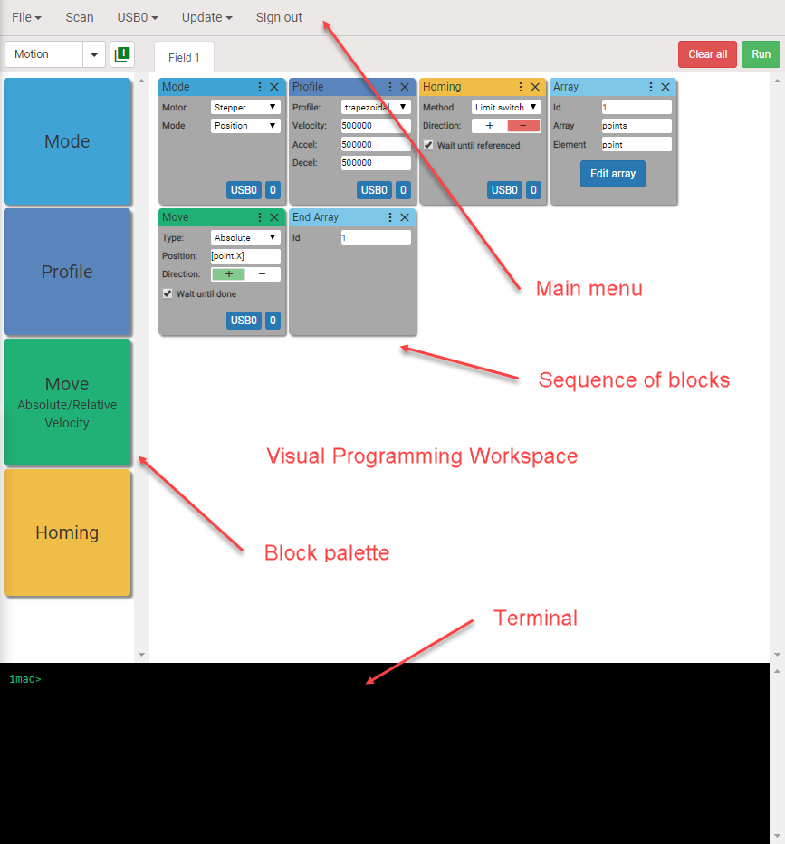

## Block Palette

Block palette contains the following command block categories:

- Motion Blocks
- Time / Event Blocks
- I/O Blocks
- Control Flow Blocks
- Math Blocks
- Variable Blocks
- Mics. Blocks
- User Blocks

### Motion Blocks

#### Mode

Allows to set type of the motor and the mode in which motor works.

*Motor type*:
+ Stepper
+ Servo

*Operating mode*:
+ Position

Sets the motor ***type*** to *`Stepper`* and operating ***mode*** to *`Position`* for axis `0` on the port `USB0`.

#### Profile

Allows to set the motion characteristics.

*Profile*:
+ trapezoidal
+ s-curve

*Velocity*: positive integer [*counts/sec*]

*Acceleration*: positive integer [*counts/sec^2*]

*Deacceleration*: positive integer [*counts/sec^2*]

*Jerk*: positive integer [*counts/sec^3*]

Sets the motion ***profile***, ***velocity***, ***acceleration***, ***deaceleration*** and ***jerk*** for axis `0` on the port `USB0`.

#### Move

Allows to set the type of motion, absolute position or relative distance, direction of the motion. By default the checkbox `Wait until done` is checked and that means that next block in the sequence will not be executed until the motion is completed.

*Type*:
+ Absolute

  Uses when you need to move the axis relative to current homing position.

+ Relative

  Uses when you need to move the axis relative to current position.

*Position*: positive or negative integer [*counts*]

*Distance*: positive or negative integer [*counts*]

*Direction*: [*Positive / Negative*]

Multiplies the value of ***position*** or ***distance*** by `1` if Positive, and `-1` if Negative.

*Wait until done*: [*True / False*]

Sets motion ***type*** to *`Absolute`* or *`Relative`*, ***position*** to absolute position in counts, ***direction*** to positive or negative, ***distance*** to relative position in counts, ***wait until done*** to *`True`* or *`False`* for axis `0` on the port `USB0`.

#### Homing

Allows to set the homing position.

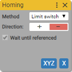

*Method*:
+ Current position

  Uses when the currect position is needed to be set as homing position.

+ Limit switch

  Uses when one of limits is needed to be set as homing position.

*Direction*: [*Positive / Negative*]

Works only with *`Limit switch`* method. Indicates that ***positive*** or ***negative*** limit switch is selected to be a homing position.

*Wait until referenced*: [*True / False*]

Waits for axis completes the homing positioning.

Sets homing ***method*** to *`Current position`* or *`Limit Switch`*, ***direction*** to positive or negative, ***wait until referenced*** to *`True`* or *`False`* for axis `0` on the port `USB0`.

### Time / Event Blocks

#### Wait for digital input

Waits for `High` or `Low` on digital input. The next block in the sequence will be executed only if expected value comes on given input.

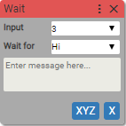

*Input*: [*1 - 12*]

*Wait for*: [*Hi / Lo*]

Waits for *`Hi`* on input *`1`* for axis `0` on the port `USB0`.

#### Listen to event

Listens to events. The next block in the sequence will be executed only if awaited event happens.

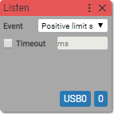

*Event*:
+ Positive limit switch
+ Negative limit switch

*Timeout*: [*ms*]

If during the specified time the event is not occurred, the error will be thrown and the further processing of the sequence of blocks will be stopped.

Awaits the positive limit switch is triggered at the axis `0` on the port `USB0`.

#### Delay

Waits for specified milliseconds.

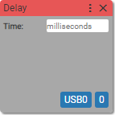

*Time*: [*ms*]

Waits for the specified time. The next block in the sequence will be executed only after the time is expired.

#### Wait until done

Waits until the motion launched by previous block is completed.

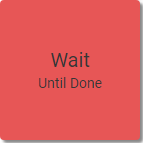

Example:

The block **`Wait until done`** checks the motion at axis `0` on the port `USB0`. If the motion does not exist (or the motion is ended) the next block in the sequence will be allowed to run.

### I/O Blocks

#### Set digital output

Sets the output control register to `High` or `Low`.

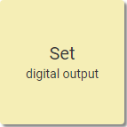
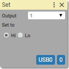

*Output*: [*1 - 4*]

*Set to*: [*Hi / Lo*]

When output is set to *Hi* output transistor is open, conducting current to the load.

When output is set *Lo* output transistor is closed, no current flows to the load.

#### Read digital input

Reads the value of input.

*Input*: [*1 - 12*]

Reads the value of specified input and saves this value in the program's internal memory. The value can be used in the IF-ELSE statement. Also the value can be assigned to variable name.

### Control Flow Blocks

#### Repeat

Repeat block opens the beginning of the repeated part of the sequence of blocks.

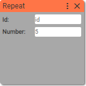

*Id*: positive integer or word without special characters
+ should be unique. Identifies a chain of blocks that will be repeated.

*Number*: positive integer
+ defines how many times blocks will be repeated.

Says to IMAC interpreter that starting from the next block there is a chain of blocks ended with End Repeat block with the same `Id` and that chain of blocks should be repeated `Number` times.

#### End Repeat

End Repeat block defines the end of the repeated part of the sequence of blocks.

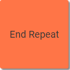
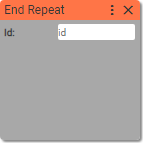

*Id*: positive integer or word without special characters
+ should be matched to `Id` of Repeat block.

Says to IMAC interpreter that here is the end of a chain of blocks started with Repeat block with the same `Id`.

#### If

### Math Blocks

Math Blocks Here

### Variable Blocks

Variable Blocks Here

### Mics. Blocks

Mics. Blocks Here

### User Blocks

User Blocks Here

## Working with IMAC files

There are two options available to save IMAC program:

1.	Save program to IMAC’s file system.

Go to _Main Menu_ => _File_ and click _Save to IMAC_. Save file dialog will open.

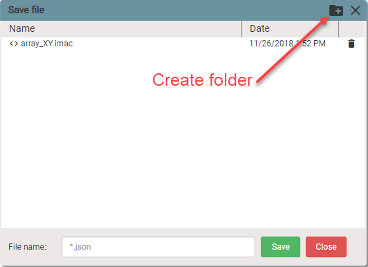

Organize your files by creating folders. Click _Create folder_ icon and additional form will appear.

Enter the name of file and click Save.

2.	Save program to your PC file system or some local network shared resource.

Go to _Main Menu_ => _File_ and click _Save to PC_. This is standard Windows File Explorer dialog box.

To open saved IMAC programs go to IMAC _Main Menu_ => _File_ and choose _Open from PC_ or _Open from IMAC_. The same dialog boxes will be opened, just select desired file and click Open. The blocks saved in the opened file will be displayed on the visual programming workspace. Modify the blocks, add new ones or just run them.

## Updating IMAC Software

IMAC applications are under the active development. Improvements and new features are being added. Users ask to add new blocks with custom functionality. When the new IMAC software version is available, user can update the application. There are two way to update application:

1. Over the Internet

The link of updated version will be provided. Go to _Main Menu_ => _Update_ and click _Online_. The dialog box will be displayed.

Insert provided URL into the text field and click Update. The progress of installation can be observed in the terminal. When the installation is completed application will be reloaded. Type `version` into the terminal and press Enter to verify that application is updated successfully.

2.	From the zipped file on the user hard drive. User will be provided with link to new version for downloading. Downloaded zip file can be saved on local PC. Go to _Main Menu_ => _Update_ and click Offline. The dialog box will be displayed.

Click _Choose File_. The standard Windows File Explorer window will be displayed. Navigate to the saved zip file and open it. Click Update. The progress of installation can be observed in the terminal. When the installation is completed application will be reloaded. Type `version` into the terminal and press Enter to verify that application is updated successfully.

## Sending ASCII commands through the terminal

User has a full control over the **IDRIVES** through the Terminal. Refer to the _ASCII Programmer’s Guide_ for available commands and syntax. The syntax of IMAC ASCII message is:

[_usb port_]:[_axis letter_][_command code_][_command parameters_]

Examples:

usb0: 1 g r0x70

Get the value of register `0x70` at axis `1` of **IDRIVE** connected to USB port 0.

usb0: 0 s r0xc8 0

Set the trajectory generator to absolute move, trapezoidal profile

usb0: t 2

Execute homing.
