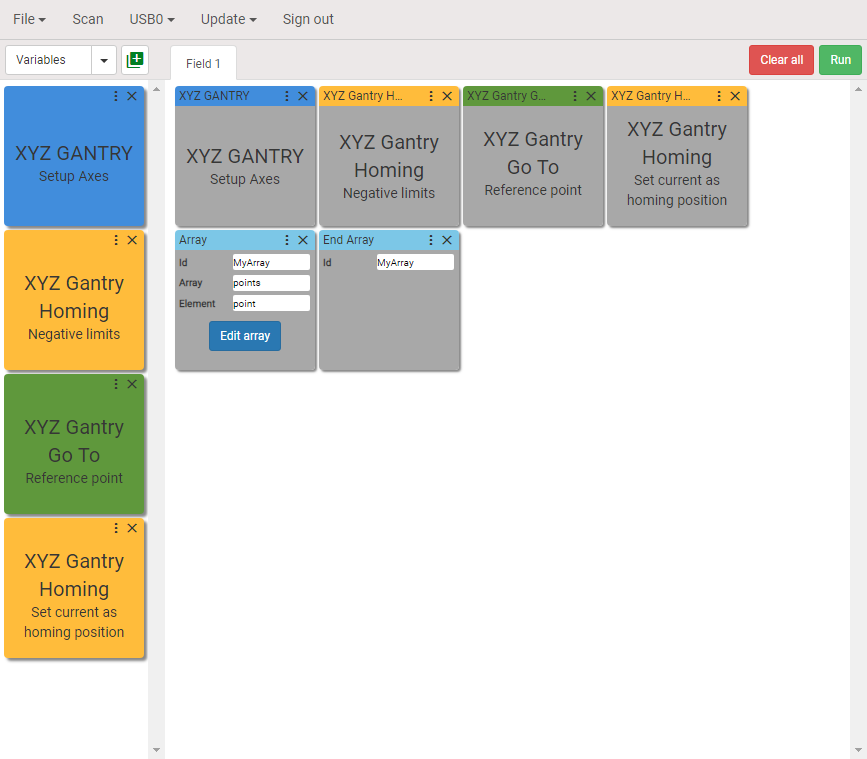

## Demo

Click on the image to watch demo on Youtube.

## Motors setup for X, Y and Z axes

### Step 1. Configuring Mode and Profile blocks

Drag and drop Mode and Profile blocks onto the visual programming workspace for X, Y and Z axes. Define the motor type, motion mode, profile, velocity, acceleration and deceleration.

> Note: 0 is X; 1 is Y; 2 is Z.

### Step 2. Create the user block

Using `CTRL + Left Mouse button` select all six blocks and click `Create user block` button as shown. Give a name to the user block, pick the color and click `Create`.

The created user block will appear under the category `User`. Remove six blocks and replace them with just created user block.

## Homing position

### Step 3. Setting negative limits as homing positions

Drag and drop Homing blocks. Select method `Limit switch` and direction `Negative`.

### Step 4. Create the user block

Using `CTRL + Left Mouse button` select three added blocks and click `Create user block`. Give a name to the user block, pick the color and click `Create`. The user block will be added to category `User`. Replace homing blocks with the created user block.

## Setting the reference point for an array

### Step 5. Move to the reference point.

Set the reference position for an array. Drag and drop three Move blocks onto the visual programming workspace. Configure them as shown below.

Create the user block. Replace `Move` blocks with created user block.

### Step 6. Set the reference position as homing position.

Drag and drop three `Homing` blocks onto the visual programming workspace and configure the blocks as shown below.

Create the user block. Replace `Homing` blocks with created user block.

## Creating array

Our goal is moving the marker from point to point and draw the dots. We will create an array of points with X and Y coordinates.

### Step 7. Array blocks

Drag and drop `Array` and `End Array` blocks onto the visual programming workspace and configure them as shown below.

### Step 8. Editing Array table

Click `Edit array` button. The `Edit Array` dialog box will be opened.

There is only one point now with coordinates `{X: 0, Y: 0}` in the table. We are going to create an array `5x4`. The distance between the points along `X` and `Y` axes is `300000` counts. The marker will be moving at first (four points) from point to point along axis `Y` in positive direction, then doing shift along axis `X` by `300000` counts in positive direction to the next row of points and moving backward along the axis `Y` in negative direction. The marker will move so through each row until all points in the array are performed.

Additionally we will add a property called `Delay` to each point in the array. Delay is a time in `[ms]` the marker will wait for when it touches the surface of the paper. Just notice that you can add whatever property you want to the elements of the array and use this property in any appropriate block between the `Array` and `End Array` blocks.

Below is table with points.

Click `Save` button to save points into the `Array` block.

## Adding motion between the Array and End Array blocks

### Step 9. Add motion along X and Y axes

Add two `Move` blocks as shown below. Type `"point.Y"` and `"point.X"` (in double quotes) into the position fields. What does it mean? Look at `Array` block. The field `Element` has value `point`, it means that every row in the table is accessible as `point`. We have to use the following format to get value of columns:

> `"<elementname>.<columnname>"`, where `point` is `<elementname>` and `X`, `Y` and `Delay` are `<columnname>`.

### Step 10. Add motion along Z axis

Add and configure another blocks as shown below. What will happen here?

The `Z` axis will move 100000 counts in positive direction, the marker will touch the surface of the paper. The `Z` axis will wait for `"point.Delay"` ms (500ms) and the axis will move back 100000 counts to the starting position.

> We suppose that there are 100000 counts between the surface of paper and the marker at its starting position.

## Putting Array's blocks into the repeat and adding the Homing method at the end of program

### Step 11. Repeat Array two times and return gantry system to the system homing position

Add `Repeat` and `End Repeat` blocks, put `Array` blocks between Repeat and End Repeat blocks. The `Ids` of Repeat and End Repeat blocks should be matched. Enter the number of repeats (`2`) into the `Number` field of `Repeat` block. Add previously saved user block `Homing Negative limits` to return gantry system to the starting position.

We Done! Thank you.