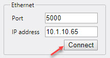
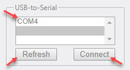

## How to install, configure and use Ethernet Motion Server

If you control motors using USB go to [USB to Serial](#3.3-Use-with-USB-to-serial) paragraph.

### 1. Ethernet to Serial

Before **IMAC.ETH** can be used with **IDRIVES** it has to be configured. Plug in the Ethernet cable and power the device up.

1.1 **Obtain a valid IP address for the device from your network administrator.**

Usually it's some ip address in your network which is not being used by any other device or PC.

1.2 **Obtain MAC address from the label on the device bottom panel.**

1.3 **Download and install device search utility**

[Download device search utility](https://onedrive.live.com/download?cid=F106C188C03C5E38&resid=F106C188C03C5E38%2168229&authkey=ABzWeAkdUtFphJ4)

Unpack zip file and run installation file. At the end of installaction desktop shortcut will be created on the desktop.

<figure>
  
</figure>

1.4 **Assign IP Address to device**

Run device search utility. Click search button.

<figure>
  
</figure>

Discovered device should have MAC address obtained on step 2. Check if MAC address is matched.

Select device and click Un-lock button. Enter default password - `moxa`.

<figure>
  
</figure>

Now click on Assign IP button and enter IP address from step 1.

<figure>
  
</figure>

1.5 **Configure device settings with web interface.** 

Open web browser and type IP address into the address bar.

Type in IP address assigned on previous step. Enter default password - `moxa`.

Select Serial Settings -> Port 1. Change baudrate to *9600* and Flow Control to *None*. All as shown below.

<figure>
  
</figure>

Click submit and go to home page.

Open Operating Settings -> Port 1. Select TCP Server Mode as Operating Mode. Set TCP alive check time to 0. Enable Delimiter 1 and type 0D into the Delimiter 1 field. Select Strip Delimiter as Delimiter Process. Assign port number 5000 as Local TCP port. All as shown below.

<figure>
  
</figure>

Click submit. Save and restart.

Now IMAC.ETH is configured and ready to communicate with IDRIVES.

### 2. USB to Serial

Connect IDrive to USB over USB-to-RS232 adapter or directly to COM port.

### 3. Testing with Demo Application

3.1 **Download and install**

[Click here to download v.1.1.0](https://onedrive.live.com/download?cid=F106C188C03C5E38&resid=F106C188C03C5E38%2168261&authkey=AIGwTg9A4VsYclA)

[Click here to download v.1.2.0](https://onedrive.live.com/download?cid=F106C188C03C5E38&resid=F106C188C03C5E38%2168793&authkey=ACOloRbYC8KW2Co)

Run downloaded file and go through the simple installation process.

The following desktop shortcut will appear on your desktop.

<figure>
  
</figure>

Double click on shortcut to run demo program.

<figure>
  
</figure>

3.2. **Use with ethernet to serial**

Specify IP (assigned on step 1.4) and port (assigned on step 1.5) and click Connect.

<figure>
  
</figure>

#### 3.3 Use with USB to serial

Click refresh button to see all available COM ports on your PC.

Select COM port and click Connect.

<figure>
  
</figure>

3.4. **Control motors**

Select axis, select motor type for selected axis.

Enable motor by clicking inside enable motor checkbox.

Activate Jog groupbox by clicking inside Activate Jog checkbox. 

Turn motors in positive or negative direction by clicking on Positive or Negative buttons.

Deactivate Jog groupbox.

Enter distance in motor counts into Distance text field.

Click Move. At any time you can abort motion by clicking on Abort button.

Click Home button to home selected axis. At any time you can abort motion by clicking on Abort button.

Enter ASCII command into Command text field and click Enter. Use [ASCII Programmer's Guide](http://www.copleycontrols.com/wp-content/uploads/2018/02/All-ASCII_Programmers_Guide-Manual.pdf). IDrive replies in Response text field.

Select sequence from Sequence select box. Click Run. At any time you can abort sequence by clicking on Stop button.

Sequences are programs delivered with the purchased system for testing purpose.

Before closing application, please disable all motors by selecting axes and unchecking Enable motor checkbox. Click disconnect button to close connection with IDrive. Be sure that motors does not hold a payload and turning motors off is safe.