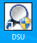
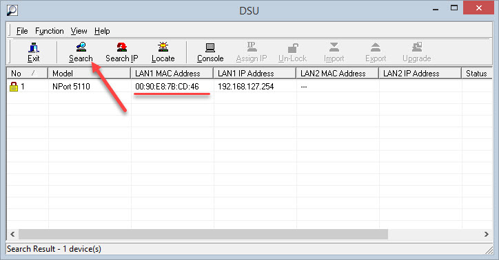
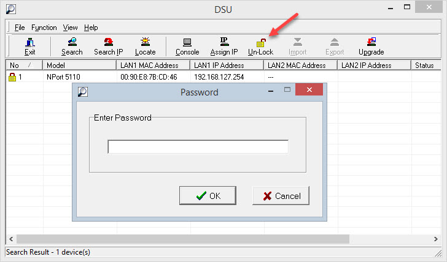
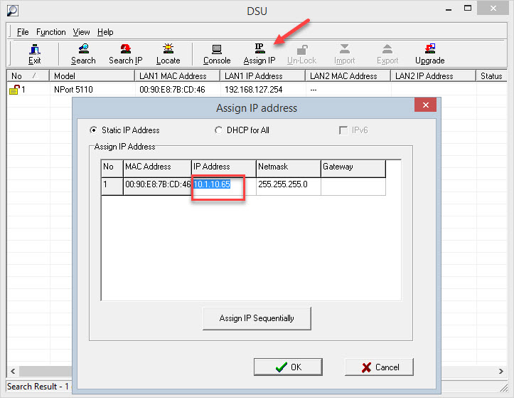
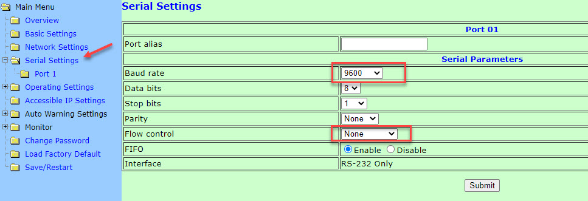
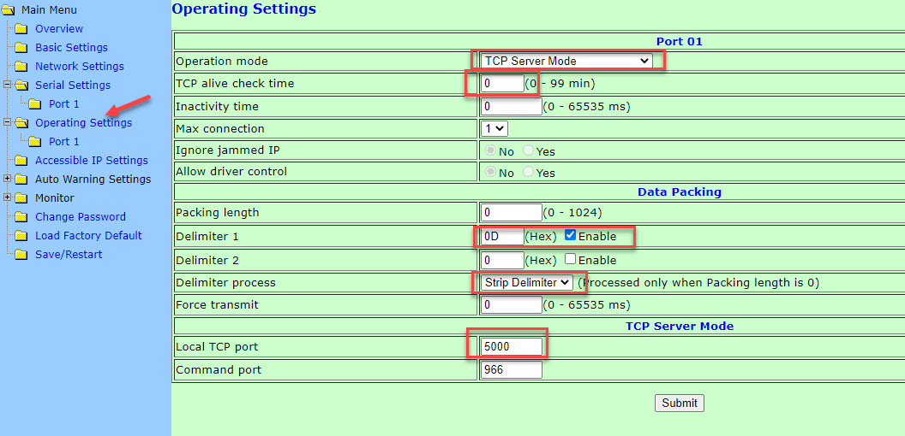

## Installation

Before **IMAC.ETH** can be used with **IDRIVES** it has to be configured. Plug in the Ethernet cable and power the device up.

1. **Obtain a valid IP address for the device from your network administrator.**

Usually it's some ip address in your network which is not being used by any other device or PC.

2. **Obtain MAC address from the label on the device bottom panel.**

3. **Download and install device search utility**

[Download device search utility](https://onedrive.live.com/download?cid=F106C188C03C5E38&resid=F106C188C03C5E38%2168229&authkey=ABzWeAkdUtFphJ4)

Unpack zip file and run installation file. At the end of installaction desktop shortcut will be created on the desktop.

<figure>
  
</figure>

4. **Assign IP Address to device**

Run device search utility. Click search button.

<figure>
  
</figure>

Discovered device should have MAC address obtained on step 2. Check if MAC address is matched.

Select device and click Un-lock button. Enter default password - `moxa`.

<figure>
  
</figure>

Now click on Assign IP button and enter IP address from step 1.

<figure>
  
</figure>

5. **Configure device settings with web interface.** 

Open web browser and type IP address into the address bar.

Type in IP address assigned on previous step. Enter default password - `moxa`.

Select Serial Settings -> Port 1. Change baudrate to *9600* and Flow Control to *None*. All as shown below.

<figure>
  
</figure>

Click submit and go to home page.

Open Operating Settings -> Port 1. Select TCP Server Mode as Operating Mode. Set TCP alive check time to 0. Enable Delimiter 1 and type 0D into the Delimiter 1 field. Select Strip Delimiter as Delimiter Process. Assign port number 5000 as Local TCP port. All as shown below.

<figure>
  
</figure>

Click submit. Save and restart.

Now IMAC.ETH is configured and ready to communicate with IDRIVES.

## Testing with Demo Application

[Click here to download](https://onedrive.live.com/download?cid=F106C188C03C5E38&resid=F106C188C03C5E38%2168225&authkey=AE1XX1_wFInIfFE)

Run downloaded file and go through the simple installation process.

The following desktop shortcut will appear on your desktop.

<figure>
  
</figure>

Double click on shortcut to run demo program.

<figure>
  
</figure>

Specify IP (assigned on step 4) and port (assigned on step 5) and click Connect.

Enable motor, move, home, jog and send ASCII commands.

Disable motor before closing application , be sure that the motor does not hold a payload and turning motor off is safe.

Program allows to communicate with IDRIVES directly over USB port. Click refresh button to list available COM ports. Select appropriate port and click Connect.