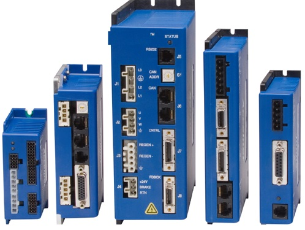

***INTELLIDRIVES MULTI-AXES MOTION and AUTOMATION CONTROLLER*** is a network based general purpose motion/automation controller with embedded intuitive **IBLOCK®** programming capability.

## Visual Block Programming Environment

**IBLOCK®** visual block programming environment runs in the web browser on any hardware and software platforms. **IBLOCK®** uses functional blocks linked together to create complex multi-axes motion control sequences of different motor types interacting with digital and analog I/O and vision systems.

**IBLOCK® Visual Editor** uses graphical blocks to represent motion commands, control of the input/output devices, variables, logic expressions, math, loops and more without having to worry about complexities of the programming languages.

## Hardware

**IMAC** controls network of Digital Stepper and Servo **I-DRIVES™** as well as digital and analog I/O.
**IMAC** can operate as a stand-alone system or connected to the user network or Internet.
As a stand-alone controller, IMAC can take the place of a PC in a control system to reduce cost. 
**IMAC** can also be configured to work in conjunction with a PC where the IMAC handles the real-time processes such as motion control and automation, and the PC is used as programming environment and GUI

#### Main Features:
-	Multi-axes (up to 32 axes) motion control over distributed **INET®** network
-	Digital and Analog I/O handling over **INET®** network
-	Simple and Visual creation of complex machine operational sequences
-	No programming experience necessary, just lay **IBLOCKS** in sequence
-	Graphical HMI Designer

3-axes system with I/O data acquisition

## IDRIVES®

**IDrives®** provide user with a performance edge. Advanced tuning and commutation algorithms, made possible by state-of-the-art DSP technology to maximize motor performance. **I-DRIVES®** offer a complete range of AC- and DC-powered digital drives for servo and stepper motors.

| Motor   | Rotary Servo and Stepper Motors  Linear Servo and Stepper Motors  Direct drive motors |
| ------- | ------------------------------------------------------------------------------------------- |
| Input power | 100-240 VAC  24-90 VDC |
| Feedback | Incremental  Analog 1Vpp  Absolute |
| Digital I/O | Limit sensors |
| Analog I/O | Home sensors  User input sourcing nad sinking sensors  Opto-isolated sensors  Outputs  Relay drivers  A/D  D/A |

## System Architecture

")

")

")

