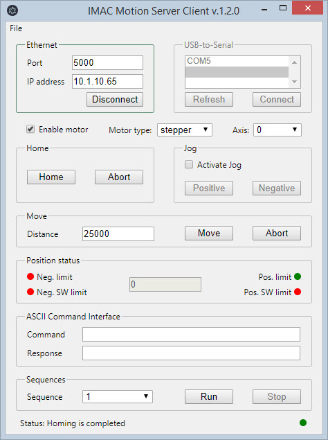

## Getting Started with IMAC.ETH

## Installation

1. Before **IMAC.ETH** can be used with **IDRIVES** it has to be configured. Plug in the Ethernet cable and power the device up.

2. Obtain a valid IP address for the device from your network administrator.

3. Obtain MAC address from the label on the device bottom panel.

4. Run MS-DOS command prompt as Administrator and execute `arp -s [IP addr] [MAC addr]`. Example: *arp -s 10.1.10.65 00-90-E8-72-98-24*

5. Execute a special telnet command `telnet [IP addr] 6000`.
Example: *telnet 10.1.10.65 6000*
    
    After issuing this command, a Connect failed message will appear. Reboot device. IP address should be updated after device reboots.

6. Now device can be configured with web interface. Open browser and type the new IP into the address bar. Example: *10.1.10.65*. The default password is "imaceth".

7. Open Serial Settings -> Port 1. Change baudrate to *9600* and Flow Control to *None*.

8. Open Operating Settings -> Port 1. Select TCP Server Mode as Operating Mode. Set TCP alive check time to 0. Enable Delimiter 1 and type 0D into the Delimiter 1 field. Select Strip Delimiter as Delimiter Process. Assign port number 5000 as Local TCP port. Press submit.

Now IMAC.ETH is configured and ready to communicate with IDRIVES.

## Testing with Demo Application

Download, install and run Demo Application. The following window appears.

<figure>
  
</figure>

Open File menu and click connect. The second window will appear. Specify port and ip address. Click on connect button and close the window.

<figure>
  
</figure>

Enable motor, change the baud rate, move, jog and send ASCII commands.
Before closing application disable motor, be sure that the motor does not hold a payload and turning motor off is safe.