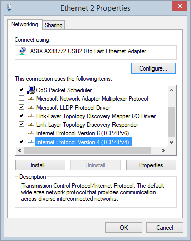

**IMAC** is preconfigured to get IP address automatically from DHCP server. If your network is configured to provide IP addresses automatically you are good. IMAC can be used in isolated networks where IMAC and user computer are connected directly over [Ethernet Crossover cable](https://en.wikipedia.org/wiki/Ethernet_crossover_cable) or using the router. To accomplish this task you follow instructions below:

## Network configuration with static IP

### User PC network configuration

1. On user computer with Windows operating system go to Control Panel -> Network and Internet -> Network Connections

2. Right click on Ethernet connection and select Properties.

3. Scroll down, select TCP/IPv4 and click Properties

  Configure TCP/IP properties 

  A. For connection over crossover cable

  B. For connection using router

4. Apply changes and close dialog windows. Now you have to set up IMAC network configuration.

### IMAC network configuration

1.	Connect keyboard, mouse and HDMI monitor to IMAC. Power it up and wait OS loading is completed.

2.	Right click on the icon as shown and left click Wireless & Wired Network Settings.

3.	Select the interface. Select `eth0` for wired or `wlan0` for wireless. Assign IP address from the range your network is working. Type `192.168.0.3/24` to assign `192.168.0.3` IP address to **IMAC**. Assign the IP address of your router – `192.168.0.1`. Assign the address of DNS server - `192.168.0.1`. Click Apply. In case you are configuring wireless connection the additional step is required.

4.	If you are configuring wireless connection you need to open the terminal.

In the terminal type `sudo raspi-config`. The textual menu will be opened.

Select Network Options. You will be asked for Country, Wifi network’s name and password. When you complete press Finish.

5.	Reboot **IMAC** and unplug keyboard, mouse and HDMI monitor. **IMAC** is ready for use in the network. Open Google Chrome (recommended browser) and go to `http://imac:5000`.