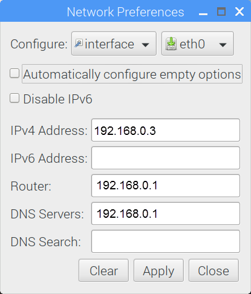
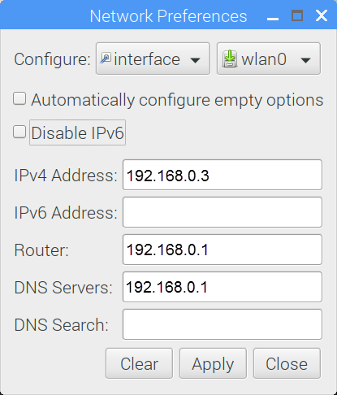
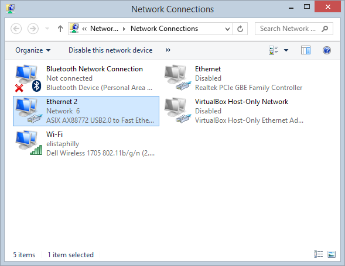
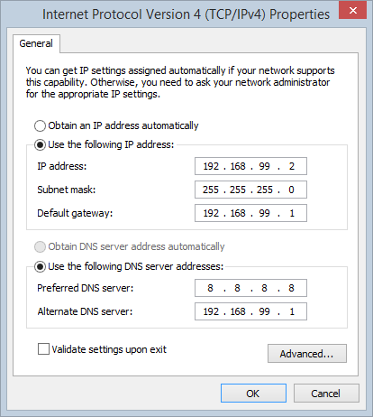

## Company network with dynamic IP addresses (DHCP server is on)

**IMAC** is preconfigured to get IP address automatically from DHCP server in your local company network. If your company network is configured to provide IP addresses automatically you are good. Just plug ethernet cable in and start working.

## Company network with static IP addresses

If your company network works with static IP addresses you have to set up static IP on IMAC. If it has not been preset on factory for you by your order, follow instructions below:

1.	Connect keyboard, mouse and HDMI monitor to IMAC. Power it up and wait OS loading is completed.

2.	Right click on the icon as shown and left click Wireless & Wired Network Settings.

3.	Select the interface. Select `eth0` for wired or `wlan0` for wireless. Obtain IP address from your network administator from the range your company's network is working. For example, type `192.168.0.3` to assign `192.168.0.3` IP address to **IMAC**. Assign the IP address of your router – `192.168.0.1`. Assign the address of DNS server - `192.168.0.1`. Click Apply. In case you are configuring wireless connection the additional step is required.

4. Additional step: if you are configuring wireless connection you need to open the terminal.

In the terminal type `sudo raspi-config`. The textual menu will be opened.

Select Network Options. You will be asked for Country, Wifi network’s name and password. When you complete press Finish.

5.	Reboot **IMAC** and unplug keyboard, mouse and HDMI monitor. **IMAC** is ready for use in the network. Open Google Chrome (recommended browser) and go to `http://imac:5000`.

## Isolated network

Also IMAC can be used in isolated networks where IMAC and user computer are connected directly over [Ethernet Crossover cable](https://en.wikipedia.org/wiki/Ethernet_crossover_cable) or using the Ethernet switch/router.

To get IMAC working in isolated network follow instructions below:

1. On user computer with Windows operating system go to Control Panel -> Network and Internet -> Network Connections

2. Right click on Ethernet connection and select Properties.

3. Scroll down, select TCP/IPv4 and click Properties

4. Apply changes and close dialog windows. IMAC comes preconfigured with IP address 192.168.99.1 for isolated network. Now you can open Chrome browser and go to `imac:5000` to start working.