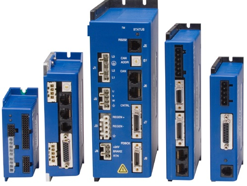

## Motion control

### IDRIVES®

**IDrives®** provide user with a performance edge. Advanced tuning and commutation algorithms, made possible by state-of-the-art DSP technology to maximize motor performance. **I-DRIVES®** offer a complete range of AC- and DC-powered digital drives for servo and stepper motors.

| Motor   | Rotary Servo and Stepper Motors  Linear Servo and Stepper Motors  Direct drive motors |
| ------- | ------------------------------------------------------------------------------------------- |
| Input power | 100-240 VAC  24-90 VDC |
| Feedback | Incremental  Analog 1Vpp  Absolute |
| Digital I/O | Limit sensors |
| Analog I/O | Home sensors  User input sourcing nad sinking sensors  Opto-isolated sensors  Outputs  Relay drivers  A/D  D/A |

## I/O devices

### SeaDAC