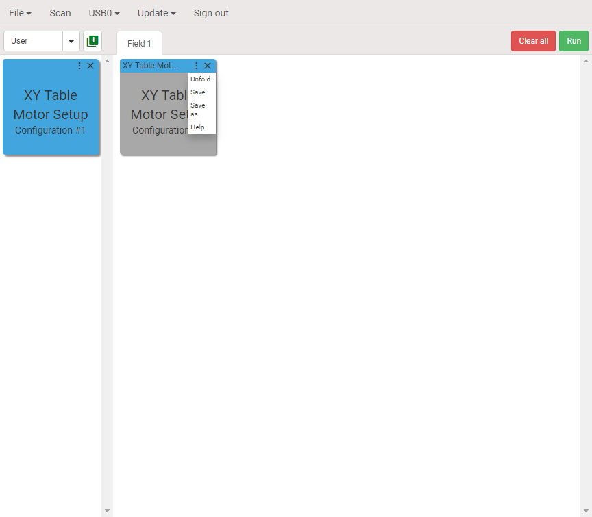
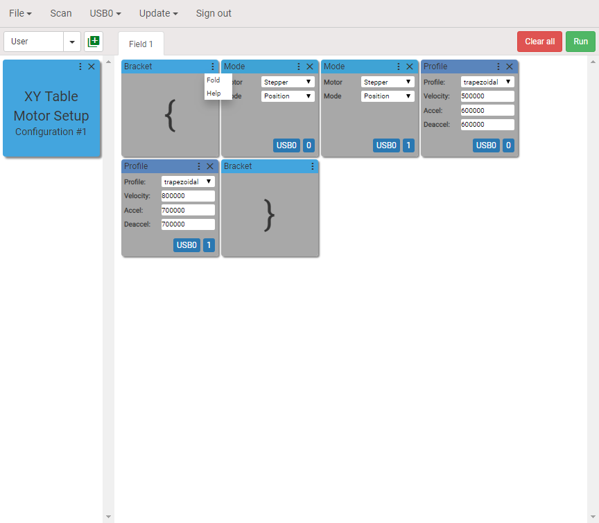
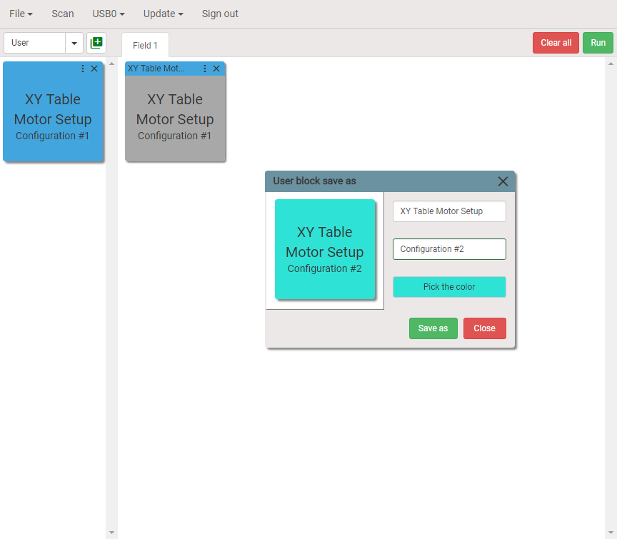

Sequence of blocks can be assembled into the user block.

Creating user blocks helps making program sequence short and readable. Assume that we have to configure the motors of XY table. To do this we need four blocks: Mode and Profile for each axis. We will create single user block which does the same but occupies less room on the visual programming workspace.

## Step 1. Selecting blocks

Use `CTRL` or `SHIFT` + `MOUSE LEFT CLICK` to select blocks. Selected blocks will be highlighted. Click the button as shown on the picture to open user block dialog. The user block dialog will pop up.

<figure class="img-inline-align-left">
  
</figure>

## Step 2. Creating user block

Give the names and pick up the color. There are two fields for names. The first field is the actual name of the block and the second name is for additional information. Both names will be displayed on the block.

<figure class="img-inline-align-left">
  
</figure>

Newly created user block will be appeared on the left under the User category.

<figure class="img-inline-align-left">
  
</figure>

## Step 3. Add user block

User block can now be added to the program sequence by dropping it onto visual programming workspace. Click `Unfold` to display the inner blocks.

<figure class="img-inline-align-left">
  
</figure>

## Step 4. Editing user block

With inner blocks displayed one can edit them, add or remove blocks. Fold blocks when finished editing by clicking `Fold`. 

<figure class="img-inline-align-left">
  
</figure>

The blocks will be folded back.
There are three options after editing the blocks:
+ *Save*. User block will be overwritten.
+ *Save as*. New user block will be created.
+ Do nothing. The changes will be saved only within the program sequence.

<figure class="img-inline-align-left">
  
</figure>

## Step 5. Save as new user block

Click `Save as` to create new user block. The dialog box shown below will appear on the screen. Choose new names and color. 

<figure class="img-inline-align-left">
  
</figure>

Click `Save as` and newly created user block will be displayed on the left.

<figure class="img-inline-align-left">
  
</figure>

We done!

