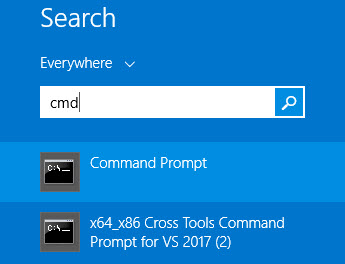
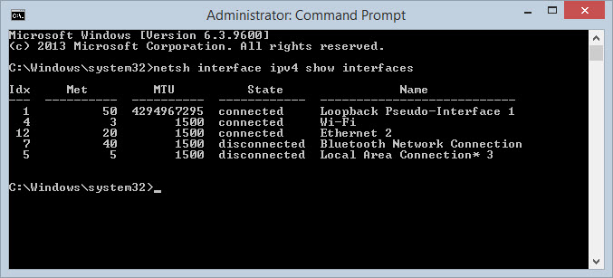
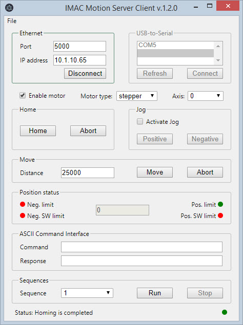

## Introduction

## Installation

Before **IMAC.ETH** can be used with **IDRIVES** it has to be configured. Plug in the Ethernet cable and power the device up.

1. **Obtain a valid IP address for the device from your network administrator.**

Usually it's some ip address in your network which is not being used by any other device or PC.

2. **Obtain MAC address from the label on the device bottom panel.**

3. **Run MS-DOS command prompt as Administrator.**

    1. Click the Start icon and click in the Search box.
    2. Type cmd into the search box. You will see the cmd (Command Prompt) in the search window.
    3. Hover the mouse over the cmd program and right-click.
    4. Select "Run as administator"

    <figure>
      
    </figure>

4. **Execute `netsh interface ipv4 add neighbors "[Interface]" [IP addr] [MAC addr]`**. 

Example: *netsh interface ipv4 add neighbors "Ethernet" 10.1.10.65 00-90-E8-72-98-24*

To find the name of the interface execute the following command: *netsh interface ipv4 show interfaces*

<figure>
  
</figure>

In the example above computer is connected to two networks: "Wi-fi" and "Ethernet 2".
Choose a network which is used to connect IMAC.ETH to the computer.

If you choose 'Ethernet 2", the command you have to execute in the command prompt will be the following:

```
netsh interface ipv4 add neighbors "Ethernet 2" 10.1.10.65 00-90-E8-72-98-24
```

where

`Ethernet 2` is the name of network interface which is used to find and connect to IMAC.ETH;

`10.1.10.65` - available IP address provided to you by network administator.

`00-90-E8-72-98-24` - MAC address printed on the label on the back panel of IMAC.ETH.


5. **Execute a special telnet command** `telnet [IP addr] [port]`.

Execute in command prompt 

```
telnet 10.1.10.65 6000
```

where `10.1.10.65` - IP address from the previous step, 
`6000` is telnet port which should be used on this step.
    
>After issuing this command, a Connect failed message will appear. Reboot device. IP address should be updated after device reboots.

6. **Now device can be configured with web interface.** 

Open browser and type IP address into the address bar. 

Example: *10.1.10.65*. The default password is "imaceth".

7. **Configure Serial communication settings**.

 Open Serial Settings -> Port 1. Change baudrate to *9600* and Flow Control to *None*.

8. **Configure TCP/IP settings**.

Open Operating Settings -> Port 1. Select TCP Server Mode as Operating Mode. Set TCP alive check time to 0. Enable Delimiter 1 and type 0D into the Delimiter 1 field. Select Strip Delimiter as Delimiter Process. Assign port number 5000 as Local TCP port. Press submit.

Now IMAC.ETH is configured and ready to communicate with IDRIVES.

## Testing with Demo Application

Download, install and run Demo Application. The following window appears.

<figure>
  
</figure>

You can communicate with motor drive over Ethernet or USB.
If you use IMAC.ETH specify IP and port of IMAC.ETH and click Connect.

Click refresh button if you connect IDRIVE over USB cable.
Select COM port and click on connect button.

Enable motor, move, home, jog and send ASCII commands.
Disable motor before closing application , be sure that the motor does not hold a payload and turning motor off is safe.